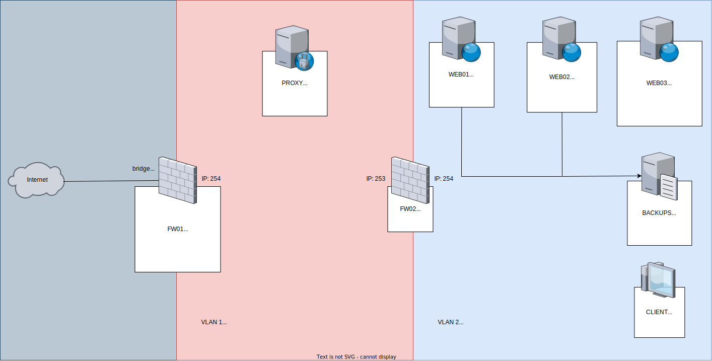

    <pre>
 █████╗ ██████╗  █████╗ ███╗   ███╗ ██████╗ 
██╔══██╗██╔══██╗██╔══██╗████╗ ████║██╔═══██╗
███████║██║  ██║███████║██╔████╔██║██║   ██║
██╔══██║██║  ██║██╔══██║██║╚██╔╝██║██║   ██║
██║  ██║██████╔╝██║  ██║██║ ╚═╝ ██║╚██████╔╝
╚═╝  ╚═╝╚═════╝ ╚═╝  ╚═╝╚═╝     ╚═╝ ╚═════╝
    </pre>

*Scenario used as a reference. The implemented scenario may have evolved over time.*
### 🔎 About
Adamo is a study project that contains some Vagrantfiles developed as part of a college project. 
The goal of this project is just to experiment with IaaS concepts using Vagrant to create and manage multiple vms.

### 🏃 RUN
If, by some curious twist of fate (or sheer madness), 
you find yourself compelled to run this project or experience its whimsical nature, follow these steps: 👺 ... 👺

### 🎯 Challenges

As part of this project, I have set several challenges to accomplish. 
These challenges serve as goals to be achieved within the project's scope. 
They are designed to explore and implement various functionalities and configurations. 
The challenges include:

- [ ] Load Balancing Service for 2 Web Servers.
- [ ] Backup Service on all servers.
- [ ] Automated Backup Routine on all servers.
- [X] Installation of a Time Server in the network, with other servers acting as clients of this local time server.
- [X] Remote Access Service on all servers.
- [ ] Hosting a single webpage on the two web servers, mounted via a network file system.
- [ ] Database Server sharing access with other servers in the network.
- [ ] Port Forwarding for accessing the third Web Server on ports 443 and 8080.
- [ ] Web Server with Virtual Hosts, configured via DNS for specific portals, and the main portal serving via HTTPS.
- [ ] DNS Server with internal and external views.

### 🤝 Contributing
Contributions are welcome! If you have any ideas, improvements, or bug fixes, please open an issue or submit a PR.
